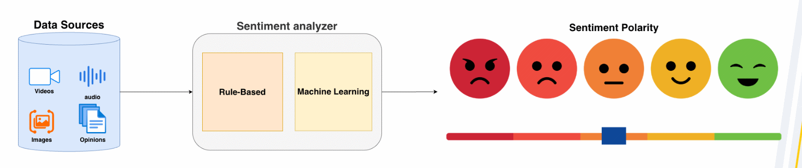
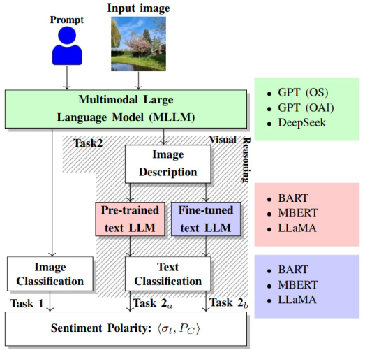
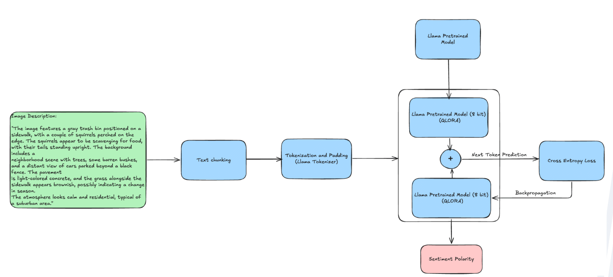
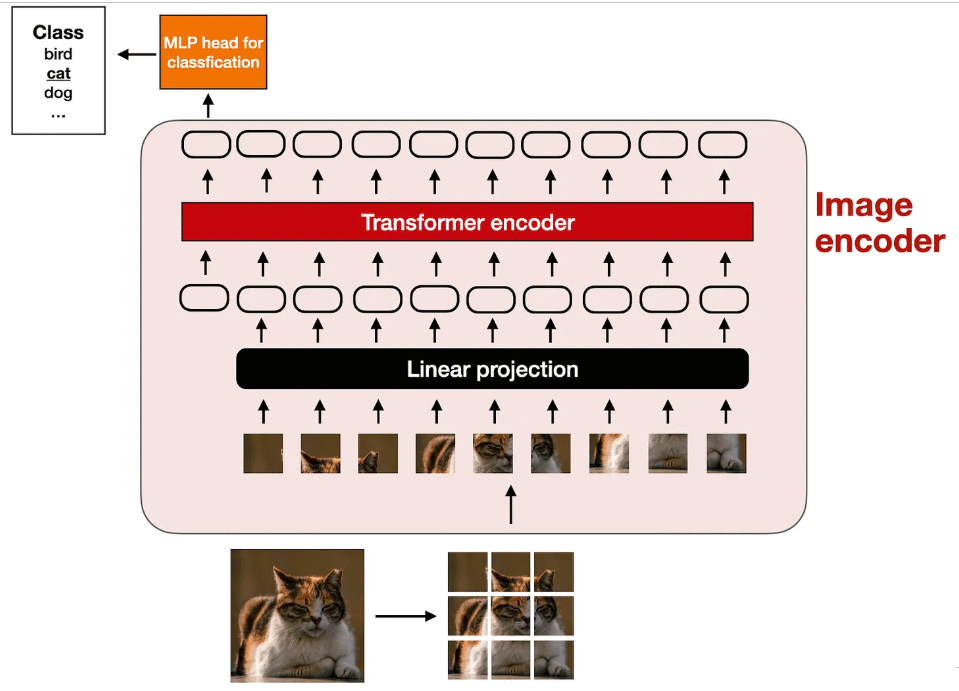
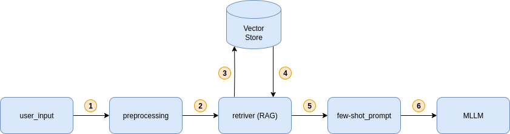

# Grandes Modelos de Linguagem Multimodais (MLLMs): Da Teoria à Prática

## Sobre o Evento (WebMedia 2025)

Realizado anualmente pela Sociedade Brasileira de Computação (SBC), o Simpósio Brasileiro de Sistemas Multimodais e Web (WebMedia) é o principal evento do tema no Brasil e uma excelente oportunidade de intercâmbios científico e técnico entre alunos, pesquisadores e profissionais das áreas de Multimídia, Hipermídia e Web.

Em 2025, especialmente, estaremos celebrando a 31ª edição do WebMedia, com organização da Pontifícia Universidade Católica do Rio de Janeiro (PUC-Rio) e do Instituto Militar de Engenharia (IME).

---

> 📌 **Nota de Publicação Futura**
> 
> Este repositório serve como material de apoio prático para o minicurso. Informamos que um material teórico completo, detalhando os conceitos e métodos aqui aplicados, será publicado futuramente. Este material servirá como referência e o bibtext estará neste README disponível.

Este repositório contém os *notebooks* desenvolvidos como exemplos práticos para o minicurso "MLLMs: Teoria e Prática", apresentado durante o **[WebMedia 2025](https://webmedia.org.br/2025/)** na PUC-RIO.

O objetivo é fornecer guias práticos sobre como aplicar Modelos de Linguagem Multimodais (MLLMs) em diferentes tarefas, como classificação de sentimentos e *fine-tuning*.

## Como Executar

Todos os *notebooks* foram desenvolvidos para execução direta na plataforma [Google Colab](https://colab.google/). Basta clicar no emblema "Open in Colab" correspondente ao caso de uso que você deseja explorar.

## Notebooks Práticos

### 1. Classificação de Sentimentos com DeepseekVL

* **Arquivo:** `use-cases/Classify_Sentiment_DeepseekVL.ipynb`
* **Descrição:** Um tutorial sobre o uso de MLLMs para inferência de sentimentos em imagens. Aborda a configuração do ambiente, carregamento do modelo (DeepseekVL), inicialização do *tokenizer*, e testes de inferência (única e em *batch*).

### 2. Fine-tuning de MLLMs com ModernBERT

* **Arquivo:** `use-cases/FineTuning_ModernBERT.ipynb`
* **Descrição:** Um guia para o processo de *fine-tuning* de MLLMs (usando o modelo ModernBERT) para a tarefa de classificação de sentimento. Cobre a criação de arquivos de configuração, preparação de dados, *setup* do modelo e a execução do treinamento.

### 3. Identificação de Objetos (Adaptação de Prompt)

* **Arquivo:** `use-cases/IdentifyFeatures.ipynb`
* **Descrição:** Este *notebook* introduz uma simples adaptação da tarefa de classificação para a identificação de objetos. A diferença principal está na estruturação do *prompt*, que busca obter uma saída estruturada para facilitar o processamento.

<figure>

<figcaption>Crédito: Imagem de Sebastian Raschka</figcaption>
</figure>

### 4. RAG com LangGraph

* **Arquivo:** `use-cases/agent_rag_langgraph.ipynb`
* **Descrição:** Um *notebook* demonstrando a implementação de um pipeline de RAG (Retrieval-Augmented Generation) utilizando a biblioteca LangGraph para orquestrar o fluxo de dados e estados.

---
